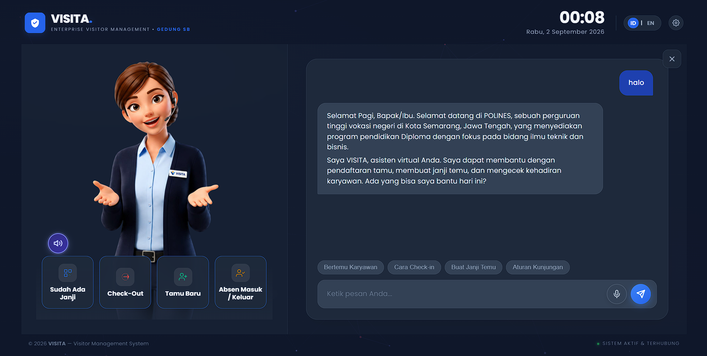
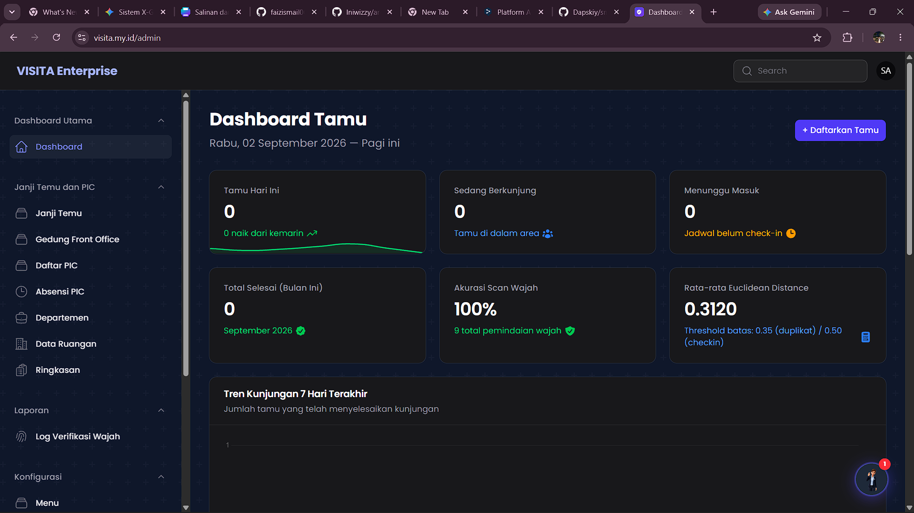
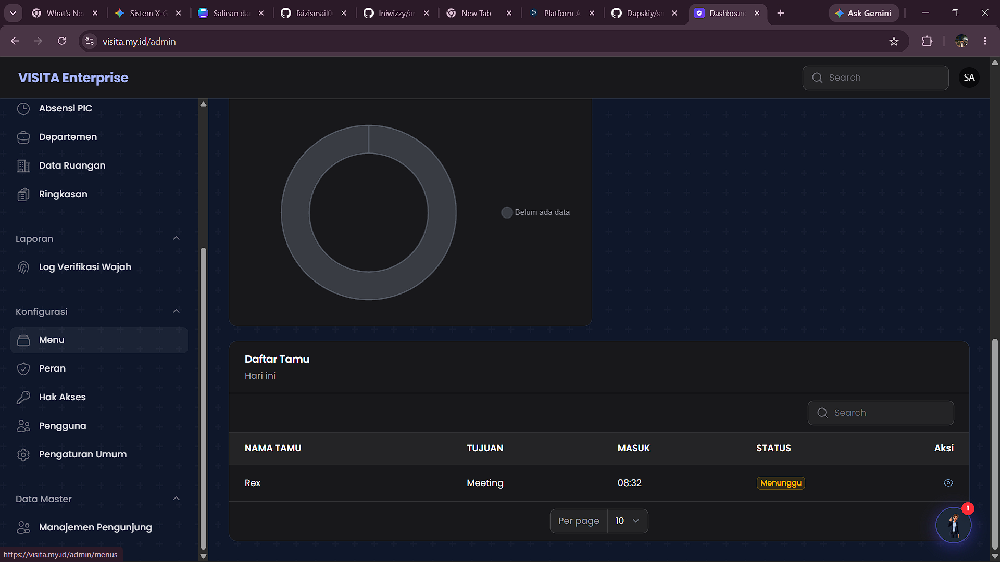

# VISITA: Smart Visitor Management System (VMS) 🏢🤖

VISITA is an enterprise-grade Smart Visitor Management System designed to modernize lobby reception and enhance building security. Built as a Final Year Project (Tugas Akhir), this system replaces traditional logbooks with an interactive Kiosk featuring **Biometric Face Recognition**, an **AI Virtual Assistant**, and automated WhatsApp notifications.

## ✨ Key Features

- 🎭 **Biometric Face Recognition (Check-in/Check-out)**
  - Seamless, touchless check-in and check-out using face biometrics.
  - Implements **Liveness Detection (Anti-Spoofing)** to prevent fake photo verification.
  - Euclidean Distance algorithm for accurate face matching with an auto-learning face accumulation system.
- 🤖 **Interactive AI Virtual Receptionist**
  - Powered by OpenAI (GPT-4o) to handle visitor inquiries interactively via Kiosk.
  - Capable of answering questions, booking appointments, and checking employee (PIC) availability in real-time.
- 🔒 **Enterprise-Grade Security & Privacy**
  - Strict compliance with Data Protection Laws (PDPA/UU PDP).
  - All biometric data (Face Features & Photos) are encrypted using **AES-256-CBC** on the database level.
  - IP Whitelisting ensures Kiosk endpoints can only be accessed from local office networks.
- 📱 **Automated WhatsApp & Email Notifications**
  - Instant WhatsApp alerts for visitors upon appointment approval (via Fonnte API).
  - Email notifications for PICs (Employees) to approve or reject visitor appointments in 1-click.
- 📊 **Advanced Admin Dashboard**
  - Built with Filament PHP for comprehensive visitor analytics, PIC management, and real-time monitoring.

## 🛠️ Technology Stack

- **Backend:** Laravel 11, PHP 8.2+
- **Frontend / Kiosk:** Livewire 3, Tailwind CSS, Alpine.js
- **Admin Panel:** Filament PHP v3
- **Database:** PostgreSQL (Optimized for JSONB face descriptors and concurrent MVCC transactions)
- **AI & Biometrics:** OpenAI API (GPT-4o), Face-api.js (TensorFlow.js)
- **Integrations:** Fonnte (WhatsApp Gateway), Mailtrap/SMTP (Email)

## 🚀 Installation & Setup

1. **Clone the repository:**
   ```bash
   git clone https://github.com/Dapskiy/smart-vms-ta.git
   cd smart-vms-ta
   ```

2. **Install PHP Dependencies:**
   ```bash
   composer install
   ```

3. **Install NPM Dependencies:**
   ```bash
   npm install
   npm run build
   ```

4. **Environment Setup:**
   Copy the example `.env` file and configure your database and API keys:
   ```bash
   cp .env.example .env
   php artisan key:generate
   ```
   **Required `.env` keys to configure:**
   - `DB_CONNECTION=pgsql`
   - `OPENAI_API_KEY=your_openai_key_here`
   - `FONNTE_TOKEN=your_fonnte_token_here`
   - Mail settings (SMTP)

5. **Run Migrations & Seeder:**
   ```bash
   php artisan migrate --seed
   ```

6. **Serve the Application:**
   ```bash
   php artisan serve
   ```
   Access the system at `http://localhost:8000`.

## 📸 Screenshots





---
**Author:** Daffa Faris Ramadhan  
**License:** [MIT License](LICENSE)
