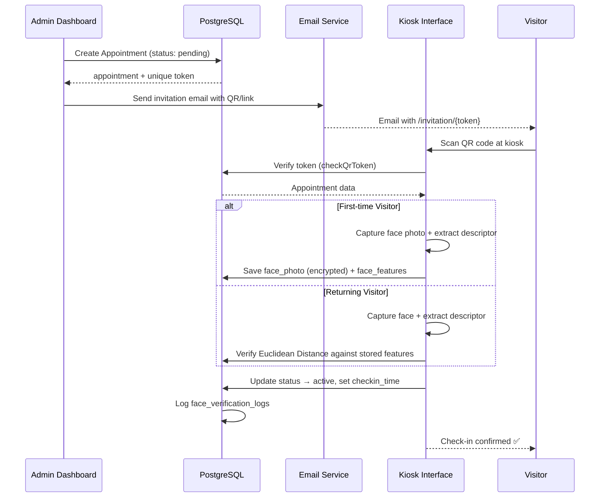
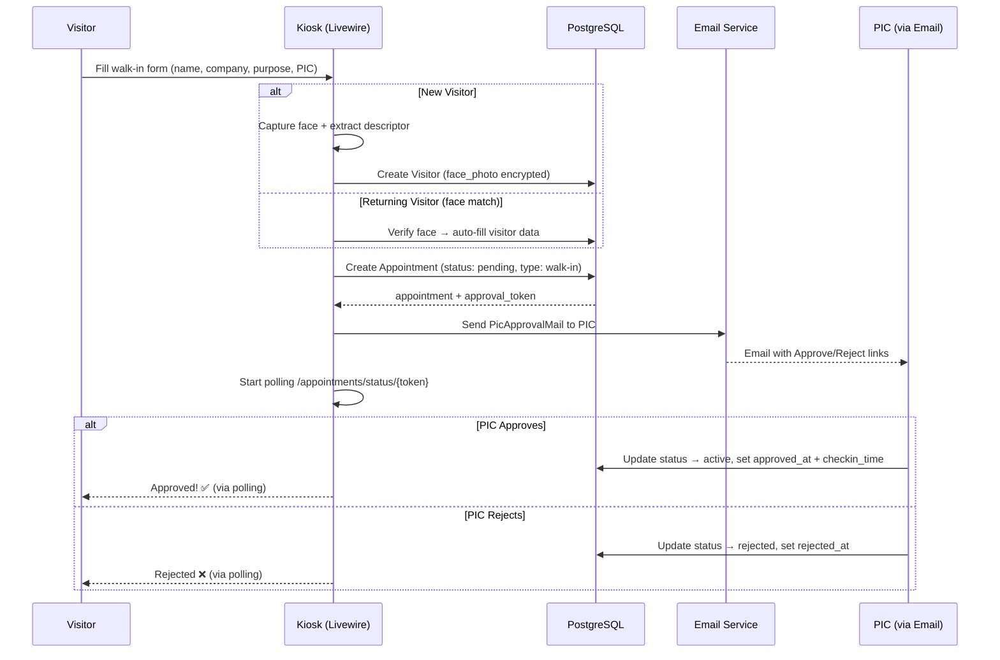
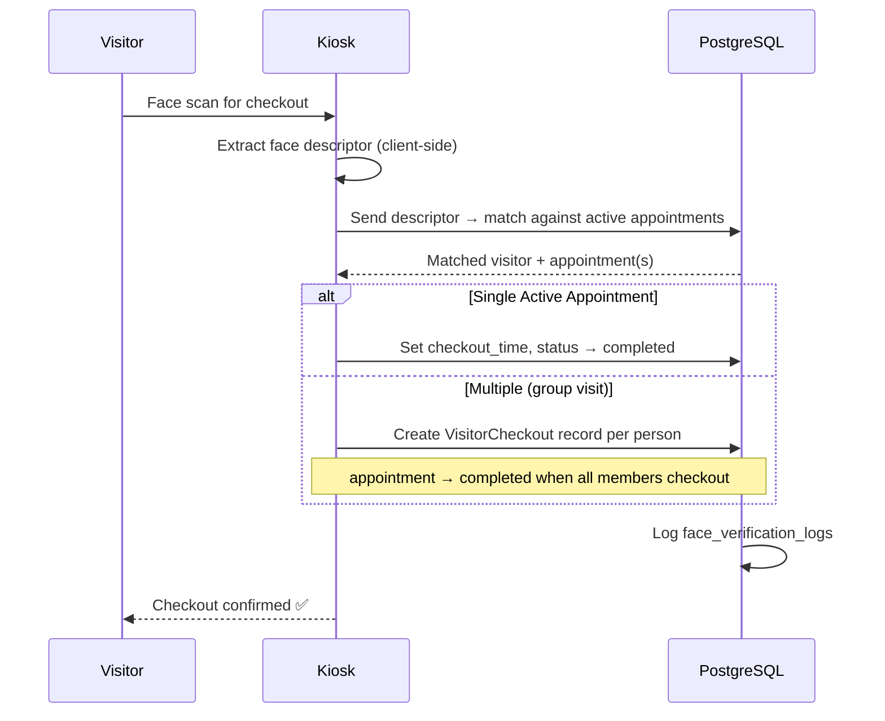
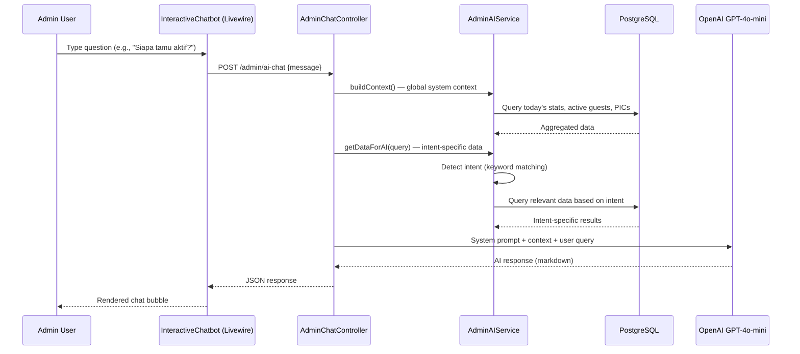
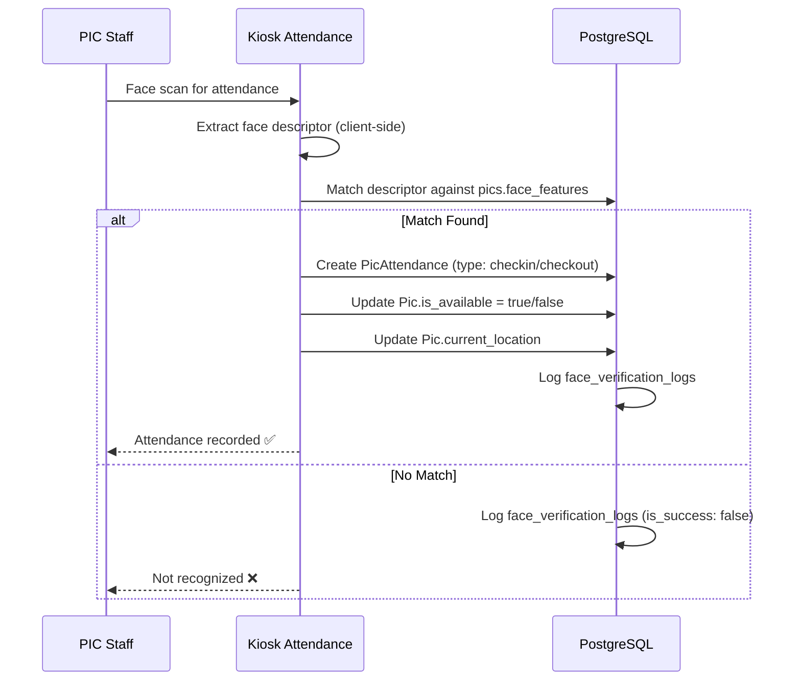
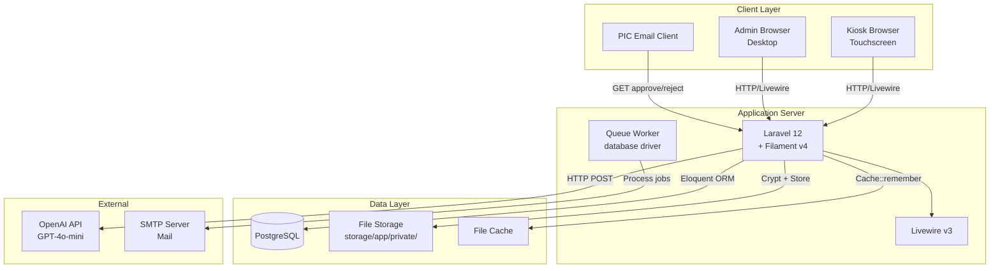

# 🏗️ Architecture Document

## Smart VMS — Technical Architecture

**Last Updated:** 2026-07-23

---

## 1. Tech Stack

### 1.1 Backend

| Technology | Version | Fungsi |
|-----------|---------|--------|
| **PHP** | ^8.2 | Runtime bahasa |
| **Laravel** | ^12.0 | Backend framework (routing, ORM, auth, queue, mail) |
| **Filament** | ^4.8.5 | Admin panel framework (TALL stack) |
| **Livewire** | v3 (bundled) | Reactive components untuk kiosk & interaktif UI |
| **Spatie Permission** | ^7.3 | Role & permission management (RBAC) |
| **Filament Shield** | ^4.2 | Auto-generate permission & policy untuk Filament resources |
| **pxlrbt/filament-excel** | ^3.6 | Export data Filament ke format Excel |
| **malzariey/filament-daterangepicker-filter** | ^5.0 | Date range filter pada tabel Filament |

### 1.2 Frontend

| Technology | Version | Fungsi |
|-----------|---------|--------|
| **Vite** | ^7.0.7 | Build tool & dev server |
| **TailwindCSS** | ^4.0.0 | Utility-first CSS framework |
| **Blade** | (Laravel) | Template engine |
| **Alpine.js** | (Livewire) | Lightweight reactive JS (bundled) |
| **face-api.js** | (CDN) | Client-side face detection & descriptor extraction |

### 1.3 Database

| Technology | Fungsi |
|-----------|--------|
| **PostgreSQL** | Primary database — relational, ACID compliant |

### 1.4 External Services

| Service | Fungsi |
|---------|--------|
| **OpenAI API** (GPT-4o-mini) | AI chatbot untuk admin assistant |

### 1.5 Dev Tools

| Tool | Fungsi |
|------|--------|
| **Laravel Pint** | PHP code formatter (PSR-12) |
| **PHPUnit** | ^11.5 — Unit & feature testing |
| **Laravel Pail** | Real-time log viewer |
| **Lefthook** | Git hooks manager (configured, not active) |
| **Concurrently** | Run multiple dev processes (server, queue, pail, vite) |

---

## 2. Struktur Folder

```
smart-vms-ta/
├── app/
│   ├── Console/               # Artisan commands
│   ├── CustomClass/           # Custom utility classes
│   ├── Filament/
│   │   ├── Exports/           # Excel export classes
│   │   ├── Pages/
│   │   │   └── Dashboard.php  # Custom dashboard page
│   │   ├── Resources/         # CRUD resources (13 resources)
│   │   │   ├── Appointments/  # Visitor appointment management
│   │   │   ├── Departments/   # Department CRUD
│   │   │   ├── FaceVerificationLogs/  # Biometric audit logs
│   │   │   ├── Menus/         # Menu/navigation management
│   │   │   ├── Permissions/   # Permission CRUD
│   │   │   ├── PicAttendances/# PIC attendance records
│   │   │   ├── Pics/          # Person in Charge management
│   │   │   ├── RoleResource/  # Role pages
│   │   │   ├── Rooms/         # Room/meeting room CRUD
│   │   │   ├── Summaries/     # Report & summary views
│   │   │   ├── Users/         # User account management
│   │   │   └── Visitors/      # Visitor registry
│   │   └── Widgets/           # Dashboard widgets
│   │       ├── GuestStatsOverview.php    # Stat cards (6 metrics)
│   │       ├── LatestGuestsTable.php     # Latest visitors table
│   │       ├── VisitPurposeChart.php     # Purpose distribution chart
│   │       └── VisitTrendChart.php       # Weekly trend chart
│   ├── Helpers/               # Helper functions (KioskHelper, etc.)
│   ├── Http/
│   │   └── Controllers/
│   │       ├── Admin/
│   │       │   ├── AdminChatController.php      # AI chatbot endpoint
│   │       │   └── VisitorFacePhotoController.php  # Face photo viewer
│   │       ├── Guest/
│   │       │   ├── FaceCheckinController.php     # Face & QR check-in
│   │       │   ├── FaceCheckoutController.php    # Face check-out
│   │       │   ├── FaceValidationController.php  # Duplicate face check
│   │       │   └── RegistrationController.php    # Guest registration
│   │       ├── AppointmentApprovalController.php # Email approval flow
│   │       └── AppointmentCheckoutController.php # Manual checkout
│   ├── Livewire/
│   │   ├── GuestRegistrationForm.php    # Invitation-based registration
│   │   ├── InteractiveChatbot.php       # AI chatbot Livewire component
│   │   ├── KioskWalkinForm.php          # Walk-in registration form
│   │   ├── TopbarAvailabilityToggle.php # PIC availability toggle
│   │   └── Kiosk/
│   │       └── PicAttendance.php        # PIC face attendance
│   ├── Mail/
│   │   └── PicApprovalMail.php  # Walk-in approval email to PIC
│   ├── Models/                # 13 Eloquent models
│   │   ├── Appointment.php
│   │   ├── Department.php
│   │   ├── FaceVerificationLog.php
│   │   ├── Menu.php
│   │   ├── Permission.php
│   │   ├── Pic.php
│   │   ├── PicAttendance.php
│   │   ├── Role.php
│   │   ├── Room.php
│   │   ├── User.php
│   │   ├── VisitLog.php
│   │   ├── Visitor.php
│   │   └── VisitorCheckout.php
│   ├── Policies/              # 11 authorization policies
│   ├── Providers/
│   │   └── AppServiceProvider.php  # Gate, PIC reset, render hooks
│   ├── Rbac/                  # Legacy RBAC module (custom package)
│   │   ├── Classes/
│   │   ├── Commands/
│   │   ├── Helpers/
│   │   ├── Http/
│   │   ├── Interfaces/
│   │   ├── Models/
│   │   ├── Traits/
│   │   ├── RbacServiceProvider.php
│   │   ├── RbacAuthServiceProvider.php
│   │   └── RbacRouteServiceProvider.php
│   └── Services/
│       ├── AdminAIService.php    # AI context builder + intent handler
│       └── VisitIdService.php    # Visit ID generator (VST-YYYYMMDD-XXXX)
├── database/
│   ├── factories/             # Model factories
│   ├── migrations/            # 35 migration files
│   ├── schema/                # Database schema dumps
│   └── seeders/               # 8 seeder files
│       ├── DatabaseSeeder.php
│       ├── MenuPermissionClassifierSeeder.php
│       ├── RolePermissionSeeder.php
│       ├── RoomSeeder.php
│       ├── SecuritySeeder.php
│       ├── ShieldSeeder.php
│       └── SuperAdminSeeder.php
├── resources/
│   ├── css/                   # Stylesheets
│   ├── js/                    # JavaScript assets
│   ├── lang/                  # Translations
│   └── views/
│       ├── appointments/      # Approval response views
│       ├── components/        # Blade components
│       ├── emails/            # Email templates
│       ├── filament/          # Filament panel customizations
│       ├── layouts/           # Layout templates
│       ├── livewire/          # Livewire component views
│       ├── kiosk-lobby.blade.php   # Main kiosk interface (122KB)
│       ├── welcome.blade.php       # Landing/welcome page (148KB)
│       └── landing.blade.php       # Alternative landing page
├── routes/
│   ├── web.php                # Web routes (public & auth)
│   └── console.php            # Console/scheduler commands
├── config/                    # Laravel + package configurations
├── tests/                     # PHPUnit tests
├── public/                    # Public assets
└── docs/                     # Documentation (this folder)
```

---

## 3. Flow Data Antar Service

### 3.1 Appointment Flow (Scheduled Visit)



### 3.2 Walk-in Flow (Approval Required)



### 3.3 Face Check-out Flow



### 3.4 Admin AI Chatbot Flow



### 3.5 PIC Attendance Flow



---

## 4. Keputusan Teknis

### 4.1 Kenapa Laravel + Filament (Monolith)?

| Pertimbangan | Alasan |
|-------------|--------|
| **Scope proyek** | Tugas Akhir — monolith lebih sederhana untuk develop dan deploy |
| **Filament v4** | Admin panel out-of-the-box (CRUD, dashboard, widgets) tanpa perlu build dari nol |
| **Livewire** | Reaktivitas tanpa perlu membangun SPA terpisah (React/Vue) |
| **Single deployment** | Satu server, satu codebase — mudah untuk demo |
| **Ekosistem PHP** | Spatie Permission, Shield, Excel export — semua tersedia sebagai package |

> **Trade-off:** Jika proyek berkembang jadi multi-tenant enterprise, perlu dipertimbangkan migrasi ke microservices atau minimal API + SPA arsitektur.

### 4.2 Kenapa PostgreSQL (bukan MySQL)?

| Pertimbangan | Alasan |
|-------------|--------|
| **ENUM handling** | PostgreSQL menggunakan CHECK constraint — lebih fleksibel untuk menambahkan enum value |
| **JSON native** | Kolom `companions` (JSON) dan face data lebih baik ditangani PostgreSQL |
| **Performance** | Better query planner untuk complex aggregate (dashboard stats) |
| **Standards compliance** | Lebih strict — menangkap error lebih awal |

### 4.3 Kenapa Face Recognition & Active Liveness di Client-Side (face-api.js)?

| Pertimbangan | Alasan |
|-------------|--------|
| **Tidak perlu Python service** | face-api.js berjalan di browser → tidak perlu Flask/FastAPI server terpisah |
| **Mengurangi server load** | Feature extraction (128-dimensional descriptor) & liveness verification dilakukan di client |
| **Active Liveness Detection** | Verifikasi interaktif 3-tahap (Tengok Kanan/Kiri via landmark `noseRatio` + Senyum via `happy` expression) mencegah serangan foto (photo spoofing) |
| **Offline capable** | Model TensorFlow.js di-load dari CDN/local, bisa digunakan tanpa internet (setelah cache) |
| **Euclidean Distance** | Perbandingan descriptor cukup sederhana → bisa dilakukan di PHP backend |

> **Trade-off:** Akurasi lebih rendah dibanding server-side model heavy (dlib, ArcFace). Namun kombinasi dengan **3-Stage Active Liveness** memberikan keamanan anti-spoofing yang sangat tinggi di layar Kiosk.

### 4.4 Kenapa Face Data Dienkripsi (Tidak Pakai Eloquent Cast)?

```
face_photo  → Custom Accessor/Mutator (manual Crypt)
face_features → Custom Accessor/Mutator (manual Crypt)
```

| Pertimbangan | Alasan |
|-------------|--------|
| **Data sensitivity** | Face descriptor + photo adalah data biometrik — wajib dienkripsi |
| **Eloquent cast limitation** | `encrypted:array` cast pada data besar (base64 photo) menyebabkan overhead & sulit debug |
| **Backward compatibility** | Data lama (plain JSON) masih bisa dibaca via fallback di accessor |
| **File-based storage** | Face photo disimpan sebagai `.enc` file (bukan blob di DB) untuk mengurangi database size |
| **Double-encode prevention** | Custom accessor mencegah konflik antara cast pipeline dan accessor pipeline |

### 4.5 Kenapa Polling (Bukan WebSocket) untuk Walk-in Approval?

| Pertimbangan | Alasan |
|-------------|--------|
| **Simplicity** | Tidak perlu setup Pusher/Laravel Echo/Redis |
| **Kiosk use case** | Polling setiap 3-5 detik cukup responsif untuk use case approval |
| **No persistent connection** | Kiosk mungkin di-restart berkala — polling lebih resilient |

> **Trade-off:** Untuk scaling (ratusan kiosk), sebaiknya migrasi ke WebSocket (Laravel Reverb/Pusher).

### 4.6 Kenapa Spatie Permission + Filament Shield?

| Pertimbangan | Alasan |
|-------------|--------|
| **Spatie Permission** | De facto standard RBAC di Laravel — well-maintained, documented |
| **Filament Shield** | Auto-generate permission per resource Filament (`view_*`, `create_*`, `update_*`, `delete_*`) |
| **Policy auto-bind** | Shield auto-creates Policy files yang integrate dengan Gate |
| **super_admin bypass** | `Gate::before` memastikan super_admin tidak perlu permission individual |

### 4.7 Kenapa Visit ID Format VST-YYYYMMDD-XXXX?

| Pertimbangan | Alasan |
|-------------|--------|
| **Human-readable** | Mudah diidentifikasi kapan kunjungan terjadi |
| **Sequential per hari** | Auto-increment counter per tanggal — tidak overlap antar hari |
| **Unique constraint** | Database-level unique — tidak mungkin duplikat |
| **Traceable** | Bisa dipakai sebagai reference number di QR code dan laporan |

### 4.8 Kenapa PIC Availability Reset di AppServiceProvider?

| Pertimbangan | Alasan |
|-------------|--------|
| **Tidak butuh cron** | Menggunakan cache flag (`pic_availability_reset_date`) — triggered saat request pertama hari itu |
| **Idempotent** | Hanya berjalan 1x per hari (cache guard) |
| **Simple** | Tidak perlu setup scheduler khusus di server |

> **Trade-off:** Jika tidak ada request sama sekali di hari itu, reset tidak terjadi. Untuk production, gunakan `php artisan schedule:run` + cron.

---

## 5. Infrastructure Overview


