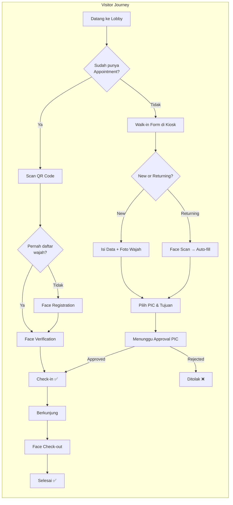
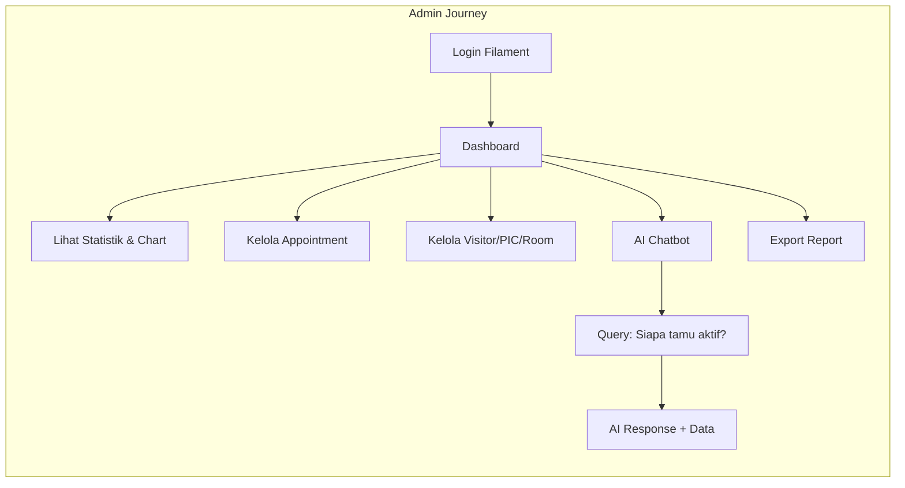
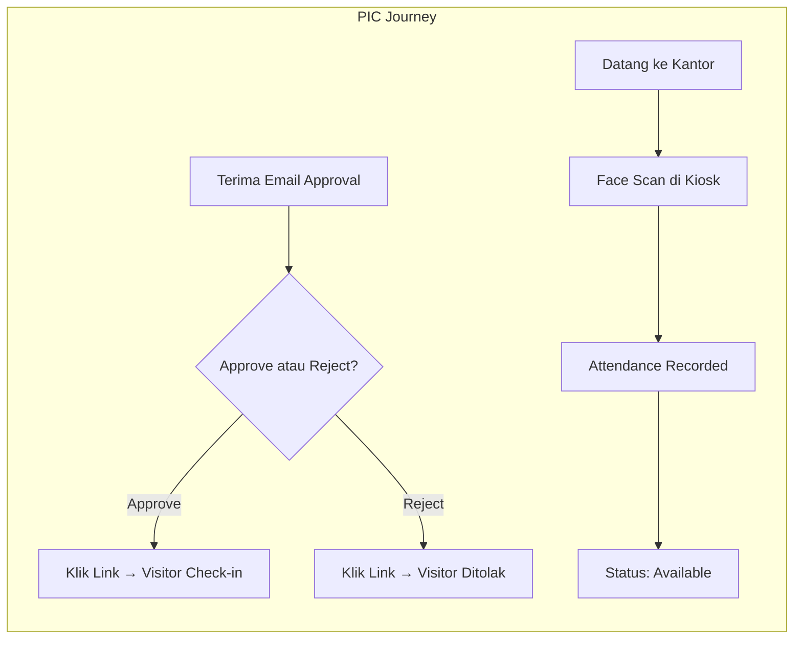

# 🎨 Design Document

## Smart VMS — UI/UX & Technical Design

**Last Updated:** 2026-07-23

---

## 1. UI/UX Flow

### 1.1 User Journey Map

Smart VMS memiliki **3 kategori pengguna** utama dengan flow yang berbeda:







### 1.2 Screen Flow — Kiosk Interface

```
┌─────────────────────────────────────────────┐
│              WELCOME SCREEN                  │
│                                              │
│    ┌──────────────┐  ┌──────────────┐       │
│    │  Walk-in /   │  │   Face       │       │
│    │  Appointment │  │   Check-in   │       │
│    └──────────────┘  └──────────────┘       │
│                                              │
│    ┌──────────────┐  ┌──────────────┐       │
│    │  Face        │  │   PIC        │       │
│    │  Check-out   │  │   Attendance │       │
│    └──────────────┘  └──────────────┘       │
└─────────────────────────────────────────────┘
         │                    │
         ▼                    ▼
┌─────────────────┐  ┌─────────────────┐
│ WALK-IN FORM    │  │ FACE CHECK-IN   │
│                 │  │                 │
│ Step 0: New or  │  │ Camera Preview  │
│   Returning?    │  │ [Scan Wajah]    │
│                 │  │                 │
│ Step 1: Data    │  │ → Match Found   │
│   Diri + Face   │  │ → Auto Check-in │
│                 │  │                 │
│ Step 2: Tujuan  │  │ → Not Found     │
│   + PIC         │  │ → Manual/QR     │
│                 │  │                 │
│ [Submit]        │  │ QR Scan Option  │
│ → Waiting       │  │ [Scan QR Code]  │
│   Approval...   │  │                 │
└─────────────────┘  └─────────────────┘
```

### 1.3 Screen Flow — Admin Dashboard (Filament)

```
┌──────────────────────────────────────────────────────────┐
│  FILAMENT ADMIN PANEL                                     │
│  ┌─────────┐                                              │
│  │ Sidebar │  ┌──────────────────────────────────────┐   │
│  │         │  │  DASHBOARD                            │   │
│  │ Home    │  │  ┌────────┐ ┌────────┐ ┌────────┐   │   │
│  │ Appoint.│  │  │Tamu    │ │Sedang  │ │Menunggu│   │   │
│  │ Visitors│  │  │Hari Ini│ │Berkunj.│ │Masuk   │   │   │
│  │ PICs    │  │  └────────┘ └────────┘ └────────┘   │   │
│  │ Rooms   │  │  ┌────────┐ ┌────────┐ ┌────────┐   │   │
│  │ Depts   │  │  │Total   │ │Akurasi │ │Avg     │   │   │
│  │ Roles   │  │  │Selesai │ │Face    │ │Distance│   │   │
│  │ Users   │  │  └────────┘ └────────┘ └────────┘   │   │
│  │ Logs    │  │                                       │   │
│  │         │  │  [Visit Trend Chart] [Purpose Chart]  │   │
│  │ AI Chat │  │  [Latest Guests Table]                │   │
│  └─────────┘  └──────────────────────────────────────┘   │
└──────────────────────────────────────────────────────────┘
```

---

## 2. Design System

### 2.1 Warna

Sistem menggunakan **Filament v4 default color system** dengan kustomisasi:

| Token | Penggunaan | Contoh |
|-------|-----------|--------|
| `primary` | Aksi utama, navigasi aktif | Button CTA, sidebar active |
| `success` | Status positif | Check-in berhasil, akurasi ≥ 90% |
| `warning` | Status pending / perlu perhatian | Menunggu approval, akurasi 70-90% |
| `danger` | Error, reject, failed | Face not match, rejected, akurasi < 70% |
| `info` | Informasi netral | Sedang berkunjung, avg distance |

### 2.2 Typography

| Elemen | Font | Size |
|--------|------|------|
| Kiosk Heading | System (Tailwind default) | text-3xl / text-4xl |
| Kiosk Body | System | text-lg / text-xl |
| Admin Dashboard | Filament default (Inter) | Standard Filament sizes |
| AI Chat Bubble | Monospace / System | text-sm |

### 2.3 Layout Patterns

| Context | Pattern |
|---------|---------|
| **Kiosk** | Full-screen, centered content, large touch targets (min 44px), no scrollbar ideal |
| **Admin** | Filament sidebar layout, responsive grid (1-3 kolom), table-centric |
| **Email** | Simple HTML email, CTA buttons (Approve/Reject), mobile-friendly |
| **Approval Response** | Single-page centered card, status icon + message |

### 2.4 Breakpoints

| Breakpoint | Penggunaan |
|-----------|-----------|
| **Kiosk** | Didesain untuk 1920x1080 touchscreen (landscape), tapi responsif ke tablet |
| **Admin** | Desktop-first (Filament default), responsif ke tablet |
| **Email** | Mobile-first (600px max-width) |

---

## 3. Komponen

### 3.1 Filament Resources (CRUD Components)

| Resource | Model | Fitur Utama |
|----------|-------|-------------|
| **Appointments** | `Appointment` | Table with status badges, inline checkout, date filters, Excel export |
| **Visitors** | `Visitor` | Face photo preview, blacklist toggle, appointment history |
| **PICs** | `Pic` | Department relation, availability toggle, face photo, linked user |
| **Departments** | `Department` | Simple CRUD, used as FK for PICs |
| **Rooms** | `Room` | Name (unique), location, description |
| **Users** | `User` | Account management, role assignment |
| **Roles** | `Role` | Permission matrix, Filament Shield integration |
| **Permissions** | `Permission` | Auto-generated by Shield, manual add possible |
| **Menus** | `Menu` | Navigation item management, sort order |
| **FaceVerificationLogs** | `FaceVerificationLog` | Read-only audit log, Euclidean Distance, success/fail |
| **PicAttendances** | `PicAttendance` | PIC check-in/check-out records |
| **Summaries** | — | Reporting/summary view |

### 3.2 Dashboard Widgets

| Widget | Tipe | Data |
|--------|------|------|
| `GuestStatsOverview` | Stat Cards (6) | Tamu hari ini, sedang berkunjung, menunggu masuk, total selesai bulan ini, akurasi scan wajah, avg Euclidean Distance |
| `VisitTrendChart` | Line Chart | Tren kunjungan 7 hari terakhir |
| `VisitPurposeChart` | Doughnut/Pie | Distribusi tujuan kunjungan |
| `LatestGuestsTable` | Table | 5-10 tamu terbaru dengan status |

### 3.3 Livewire Components

| Component | Context | Fungsi |
|-----------|---------|--------|
| `KioskWalkinForm` | Kiosk | Multi-step form: (0) New/Returning, (1) Data Diri, (2) Tujuan + PIC |
| `GuestRegistrationForm` | Guest Page | Form registrasi via invitation link |
| `InteractiveChatbot` | Admin Panel | AI chatbot floating widget |
| `TopbarAvailabilityToggle` | Admin Panel | Toggle PIC availability dari topbar |
| `Kiosk\PicAttendance` | Kiosk | Face-based attendance untuk PIC |

### 3.4 Blade Views (Major)

| View | Size | Fungsi |
|------|------|--------|
| `welcome.blade.php` | 148 KB | Landing page utama / kiosk home |
| `kiosk-lobby.blade.php` | 122 KB | Kiosk lobby interface (face scan, QR, forms) |
| `landing.blade.php` | 67 KB | Alternative landing page |

> **Catatan:** View files berukuran besar karena mengandung inline JavaScript untuk face-api.js integration, camera handling, dan UI logic.

---

## 4. Technical Design Decisions

### 4.1 Arsitektur Kiosk — Single Page dengan Multi-Section

**Keputusan:** Kiosk menggunakan satu file Blade besar (`kiosk-lobby.blade.php`, `welcome.blade.php`) dengan beberapa section yang di-toggle via JavaScript/Livewire.

**Alasan:**
- Menghindari page reload (pengalaman kiosk harus seamless)
- Camera stream tidak terputus saat pindah "halaman"
- face-api.js model hanya di-load sekali (menghindari re-download)
- Livewire memungkinkan reaktivitas tanpa full page refresh

**Trade-off:** File view sangat besar — sulit di-maintain. Idealnya dipecah menjadi Blade components.

### 4.2 Face Feature Storage — Encrypted Text di PostgreSQL

**Keputusan:**
```
visitors.face_features → TEXT (encrypted JSON array of float[128])
visitors.face_photo    → TEXT (encrypted JSON pointer to .enc file)
```

**Alasan:**
- **face_features** (128 floats) disimpan sebagai encrypted text di DB — cukup kecil (~1-2KB setelah enkripsi)
- **face_photo** (base64 image) terlalu besar untuk DB → disimpan sebagai file `.enc` di `storage/app/private/face-photos/`
- DB hanya menyimpan pointer (path) yang dienkripsi

**Alur Penyimpanan:**
```
face_photo setter:
  base64 image → binary decode → Crypt::encrypt(binary) → save .enc file → encrypt file path → store in DB

face_photo getter:
  DB string → decrypt path → read .enc file → Crypt::decrypt → base64 encode → return data URI
```

### 4.3 AI Chatbot — Keyword-Based Intent Detection

**Keputusan:** Intent detection menggunakan keyword matching (bukan NLP/ML classifier).

**Alasan:**
- Cukup akurat untuk vocabulary terbatas (PIC, tamu, check-in, checkout, blacklist, dll.)
- Tidak memerlukan training data atau model ML tambahan
- Mudah di-extend — tinggal tambah keyword array
- OpenAI sudah menangani pemahaman bahasa — keyword hanya untuk memfilter data yang dikirim

**Intent yang Didukung:**
| Intent | Keywords | Data Response |
|--------|----------|---------------|
| PIC Detail | Nama PIC spesifik | Detail PIC + tamu aktif |
| PIC Summary | pic, person in charge, departemen | Semua PIC + count tamu |
| Active Guests | tamu, check-in, aktif | Daftar tamu aktif |
| Visitor Info | visitor, pengunjung, wajah | Statistik visitor |
| Checkout Info | checkout, pulang, selesai | Tamu yang sudah checkout |
| Approval Action | approve, setuju, tolak, reject | Pending appointments |
| Blacklist Action | blacklist, blokir | Visitor list untuk blacklist |
| PIC Analytics | pic paling, sering dikunjungi | Top 5 PIC by visits |
| Face Analytics | akurasi, scan wajah, biometrik | Success rate + avg distance |
| Fallback | (no match) | Dashboard summary |

### 4.4 RBAC — Dual System (Spatie + Shield + Custom Rbac Module)

**Keputusan:** Proyek memiliki 2 sistem RBAC:

1. **Spatie Permission + Filament Shield** — aktif, digunakan untuk Filament panel
2. **Custom RBAC module** (`app/Rbac/`) — legacy/reference, inherited from base template

**Alasan:**
- Spatie + Shield adalah standar untuk Filament — auto-generate permission & policy
- Custom RBAC module ada karena project di-bootstrap dari template yang sudah include RBAC
- `Gate::before` pada `super_admin` memastikan admin penuh tidak terhambat permission

### 4.5 Appointment Status Machine

**Keputusan:** Status menggunakan PostgreSQL CHECK constraint (bukan Eloquent enum):

```
pending → active → completed
   ↓         ↓
rejected  cancelled
```

| Transition | Trigger |
|-----------|---------|
| pending → active | QR check-in, PIC approval, admin manual |
| pending → rejected | PIC reject via email |
| pending → cancelled | Admin cancel |
| active → completed | Face check-out, manual checkout, system auto-checkout |
| active → cancelled | Admin cancel |

### 4.6 Visit ID Generation

**Keputusan:** Format `VST-YYYYMMDD-XXXX` (e.g., `VST-20260723-0001`).

**Alasan:**
- Human-readable dan traceable
- Sequential per hari — counter reset setiap hari
- Unique constraint di database
- Generated saat `Appointment::creating` event — otomatis
- Parsing: regex `VST-\d{8}-(\d+)` untuk extract sequence number

### 4.7 Checkout Method Tracking

**Keputusan:** Kolom `checkout_method` pada appointments mencatat HOW visitor checkout:

| Method | Deskripsi |
|--------|-----------|
| `self` | Visitor check-out mandiri via face scan di kiosk |
| `manual` | Admin/petugas melakukan checkout dari dashboard |
| `system` | Auto-checkout oleh scheduler di akhir hari |

**Alasan:** Untuk audit trail dan analytics — bisa mengukur adoption rate self-checkout.

### 4.8 Kiosk Security — PIN + IP Whitelist

**Keputusan:** Kiosk dilindungi dengan dua lapisan:

1. **PIN** (`.env: KIOSK_PIN=654321`) — untuk akses tertentu (e.g., admin mode di kiosk)
2. **IP Whitelist** (`.env: KIOSK_ALLOWED_IPS`) — membatasi IP yang bisa mengakses kiosk routes

**Alasan:**
- Walk-in routes (`/kiosk/*`) tidak memerlukan authentication (publik)
- PIN mencegah penggunaan non-authorized di kiosk
- IP whitelist memastikan hanya perangkat di jaringan lokal yang bisa akses
- `KioskHelper::isKioskLocal()` mengecek apakah request berasal dari IP yang diizinkan
