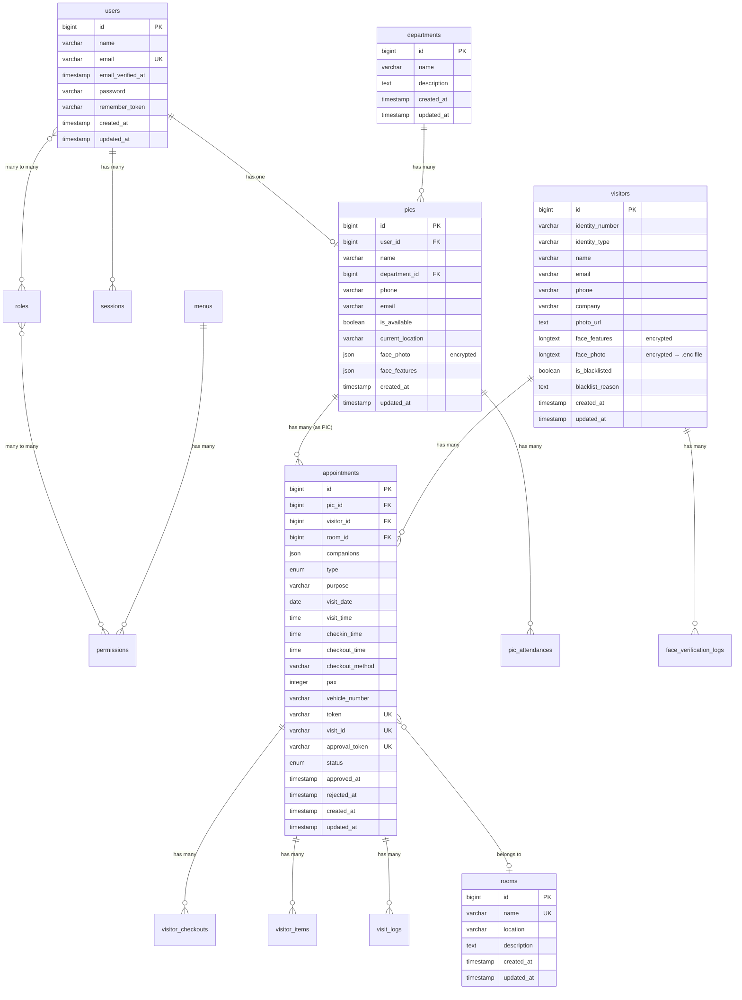

# 🗄️ Database Schema

## Smart VMS — Database Structure

**Database:** PostgreSQL  
**Last Updated:** 2026-07-23  
**Total Tables:** 17 (core) + 4 (Laravel system) + 5 (Spatie RBAC)

---

## 1. Entity Relationship Diagram



---

## 2. Tabel Detail

### 2.1 `users` — Akun Pengguna Sistem

| Kolom | Tipe | Constraint | Keterangan |
|-------|------|-----------|------------|
| `id` | `BIGINT` | PK, AUTO_INCREMENT | |
| `name` | `VARCHAR(255)` | NOT NULL | Nama lengkap |
| `email` | `VARCHAR(255)` | NOT NULL, UNIQUE | Email login |
| `email_verified_at` | `TIMESTAMP` | NULLABLE | Waktu verifikasi email |
| `password` | `VARCHAR(255)` | NOT NULL | Hashed (bcrypt, 12 rounds) |
| `remember_token` | `VARCHAR(100)` | NULLABLE | Session remember |
| `created_at` | `TIMESTAMP` | NULLABLE | |
| `updated_at` | `TIMESTAMP` | NULLABLE | |

**Relasi:**
- `HasOne` → `pics` (via `pics.user_id`)
- `HasRoles` (Spatie) → `roles` (via pivot `model_has_roles`)

---

### 2.2 `visitors` — Data Pengunjung

| Kolom | Tipe | Constraint | Keterangan |
|-------|------|-----------|------------|
| `id` | `BIGINT` | PK, AUTO_INCREMENT | |
| `identity_number` | `VARCHAR(255)` | NULLABLE | Nomor identitas (KTP/Passport) |
| `identity_type` | `VARCHAR(50)` | NULLABLE | Jenis identitas: KTP, SIM, Passport |
| `name` | `VARCHAR(255)` | NOT NULL | Nama pengunjung |
| `email` | `VARCHAR(255)` | NULLABLE | Email pengunjung |
| `phone` | `VARCHAR(255)` | NULLABLE | Nomor telepon |
| `company` | `VARCHAR(255)` | NULLABLE | Instansi/perusahaan |
| `photo_url` | `TEXT` | NULLABLE | URL foto identitas (legacy) |
| `face_features` | `LONGTEXT` | NULLABLE | **Encrypted** — 128-dim float descriptor |
| `face_photo` | `LONGTEXT` | NULLABLE | **Encrypted** — JSON pointer ke `.enc` file |
| `is_blacklisted` | `BOOLEAN` | DEFAULT false | Apakah di-blacklist |
| `blacklist_reason` | `TEXT` | NULLABLE | Alasan blacklist |
| `created_at` | `TIMESTAMP` | NULLABLE | |
| `updated_at` | `TIMESTAMP` | NULLABLE | |

**Indexes:**
- `idx_visitors_name` — B-tree index pada `name`

**Relasi:**
- `HasMany` → `appointments`
- `HasMany` → `face_verification_logs`

**Catatan Enkripsi:**
- `face_features`: Encrypted via `Crypt::encryptString()` — accessor/mutator custom
- `face_photo`: Foto disimpan sebagai file `.enc` di `storage/app/private/face-photos/`, DB menyimpan path terenkripsi

---

### 2.3 `appointments` — Janji Temu / Kunjungan

| Kolom | Tipe | Constraint | Keterangan |
|-------|------|-----------|------------|
| `id` | `BIGINT` | PK, AUTO_INCREMENT | |
| `pic_id` | `BIGINT` | FK → `pics.id`, CASCADE DELETE | PIC yang dituju |
| `visitor_id` | `BIGINT` | FK → `visitors.id`, CASCADE DELETE, NULLABLE | Pengunjung |
| `room_id` | `BIGINT` | FK → `rooms.id`, NULLABLE | Ruang meeting |
| `companions` | `JSON` | NULLABLE | Array anggota rombongan `[{name, phone}]` |
| `type` | `ENUM` | `'appointment'`, `'walk-in'` — DEFAULT `'appointment'` | Jenis kunjungan |
| `purpose` | `VARCHAR(255)` | NOT NULL | Tujuan kunjungan |
| `visit_date` | `DATE` | NOT NULL | Tanggal kunjungan |
| `visit_time` | `TIME` | NOT NULL | Waktu rencana kunjungan |
| `checkin_time` | `TIME` | NULLABLE | Waktu actual check-in |
| `checkout_time` | `TIME` | NULLABLE | Waktu actual check-out |
| `checkout_method` | `VARCHAR(255)` | NULLABLE | `'self'` \| `'manual'` \| `'system'` |
| `pax` | `INTEGER` | DEFAULT 1 | Jumlah orang |
| `vehicle_number` | `VARCHAR(255)` | NULLABLE | Nomor kendaraan |
| `token` | `VARCHAR(255)` | UNIQUE | Token invitation (QR code) |
| `visit_id` | `VARCHAR(255)` | UNIQUE, NULLABLE | ID kunjungan: `VST-YYYYMMDD-XXXX` |
| `approval_token` | `VARCHAR(64)` | UNIQUE, NULLABLE | Token approval walk-in (email link) |
| `status` | `ENUM` | CHECK constraint | Status kunjungan |
| `approved_at` | `TIMESTAMP` | NULLABLE | Waktu disetujui |
| `rejected_at` | `TIMESTAMP` | NULLABLE | Waktu ditolak |
| `created_at` | `TIMESTAMP` | NULLABLE | |
| `updated_at` | `TIMESTAMP` | NULLABLE | |

**Status ENUM Values:**
```sql
CHECK (status IN ('pending', 'active', 'completed', 'cancelled', 'rejected'))
```

**Indexes:**
- `idx_appointments_status_visit_date` — Composite B-tree `(status, visit_date)`
- `idx_appointments_pic_id` — B-tree `(pic_id)`
- `idx_appointments_visitor_id` — B-tree `(visitor_id)`
- `idx_appointments_type` — B-tree `(type)`

**Relasi:**
- `BelongsTo` → `visitors` (via `visitor_id`)
- `BelongsTo` → `pics` (via `pic_id`)
- `BelongsTo` → `rooms` (via `room_id`)
- `HasMany` → `visitor_checkouts`
- `HasMany` → `visitor_items`
- `HasMany` → `visit_logs`

**Model Events:**
- `creating`: Auto-generate `token` (random 10 char), `visit_id` (VST-format), normalize `type` ke `'walk-in'`, set default `visit_time` dan `visit_date`
- `updating`: Normalize `type` ke `'walk-in'`

---

### 2.4 `pics` — Person In Charge

| Kolom | Tipe | Constraint | Keterangan |
|-------|------|-----------|------------|
| `id` | `BIGINT` | PK, AUTO_INCREMENT | |
| `user_id` | `BIGINT` | FK → `users.id`, NULLABLE | Link ke akun user |
| `name` | `VARCHAR(255)` | NOT NULL | Nama PIC |
| `department_id` | `BIGINT` | FK → `departments.id`, NULL ON DELETE, NULLABLE | Departemen |
| `phone` | `VARCHAR(255)` | NULLABLE | Nomor telepon |
| `email` | `VARCHAR(255)` | NULLABLE | Email (untuk kirim approval) |
| `is_available` | `BOOLEAN` | DEFAULT true | Status ketersediaan |
| `current_location` | `VARCHAR(50)` | NULLABLE | Lokasi saat ini |
| `face_photo` | `JSON/TEXT` | NULLABLE | **Encrypted** — face photo (sama seperti visitor) |
| `face_features` | `JSON/TEXT` | NULLABLE | Face descriptor array |
| `created_at` | `TIMESTAMP` | NULLABLE | |
| `updated_at` | `TIMESTAMP` | NULLABLE | |

**Indexes:**
- `idx_pics_department_id` — B-tree `(department_id)`

**Relasi:**
- `BelongsTo` → `users` (via `user_id`)
- `BelongsTo` → `departments` (via `department_id`)
- `HasMany` → `appointments` (via `pic_id`)
- `HasMany` → `pic_attendances`

**Catatan:**
- `is_available` di-reset ke `false` setiap tengah malam (via `AppServiceProvider` + cache guard)
- `face_photo` menggunakan accessor/mutator yang identik dengan `Visitor`

---

### 2.5 `departments` — Departemen

| Kolom | Tipe | Constraint | Keterangan |
|-------|------|-----------|------------|
| `id` | `BIGINT` | PK, AUTO_INCREMENT | |
| `name` | `VARCHAR(255)` | NOT NULL | Nama departemen |
| `description` | `TEXT` | NULLABLE | Deskripsi departemen |
| `created_at` | `TIMESTAMP` | NULLABLE | |
| `updated_at` | `TIMESTAMP` | NULLABLE | |

**Relasi:**
- `HasMany` → `pics`

---

### 2.6 `rooms` — Ruang Meeting

| Kolom | Tipe | Constraint | Keterangan |
|-------|------|-----------|------------|
| `id` | `BIGINT` | PK, AUTO_INCREMENT | |
| `name` | `VARCHAR(255)` | NOT NULL, UNIQUE | Nama ruangan |
| `location` | `VARCHAR(255)` | NULLABLE | Lokasi (lantai, gedung) |
| `description` | `TEXT` | NULLABLE | Deskripsi ruangan |
| `created_at` | `TIMESTAMP` | NULLABLE | |
| `updated_at` | `TIMESTAMP` | NULLABLE | |

**Relasi:**
- `HasMany` → `appointments`

---

### 2.7 `visitor_checkouts` — Checkout Individu (Rombongan)

| Kolom | Tipe | Constraint | Keterangan |
|-------|------|-----------|------------|
| `id` | `BIGINT` | PK, AUTO_INCREMENT | |
| `appointment_id` | `BIGINT` | FK → `appointments.id`, CASCADE DELETE | |
| `visitor_name` | `VARCHAR(255)` | NOT NULL | Nama visitor yang checkout |
| `checkout_time` | `TIME` | NOT NULL | Waktu checkout |
| `created_at` | `TIMESTAMP` | NULLABLE | |
| `updated_at` | `TIMESTAMP` | NULLABLE | |

**Unique Constraint:**
```sql
UNIQUE (appointment_id, visitor_name)
```

**Relasi:**
- `BelongsTo` → `appointments`

**Catatan:** Digunakan untuk track checkout per individu dalam satu rombongan. Appointment → completed hanya jika semua anggota sudah checkout.

---

### 2.8 `visitor_items` — Barang Bawaan Visitor

| Kolom | Tipe | Constraint | Keterangan |
|-------|------|-----------|------------|
| `id` | `BIGINT` | PK, AUTO_INCREMENT | |
| `appointment_id` | `BIGINT` | FK → `appointments.id`, CASCADE DELETE | |
| `item_name` | `VARCHAR(255)` | NOT NULL | Nama barang |
| `serial_number` | `VARCHAR(255)` | NULLABLE | Nomor seri (laptop, dll.) |
| `created_at` | `TIMESTAMP` | NULLABLE | |
| `updated_at` | `TIMESTAMP` | NULLABLE | |

**Relasi:**
- `BelongsTo` → `appointments`

---

### 2.9 `pic_attendances` — Kehadiran PIC

| Kolom | Tipe | Constraint | Keterangan |
|-------|------|-----------|------------|
| `id` | `BIGINT` | PK, AUTO_INCREMENT | |
| `pic_id` | `BIGINT` | FK → `pics.id`, CASCADE DELETE | |
| `type` | `VARCHAR(20)` | NOT NULL | `'checkin'` \| `'checkout'` |
| `method` | `VARCHAR(20)` | DEFAULT `'kiosk'` | `'kiosk'` \| `'manual'` \| `'admin'` |
| `location` | `VARCHAR(50)` | NULLABLE | Lokasi saat attendance |
| `checked_at` | `TIMESTAMP` | NOT NULL | Waktu attendance |
| `created_at` | `TIMESTAMP` | NULLABLE | |
| `updated_at` | `TIMESTAMP` | NULLABLE | |

**Indexes:**
- `(pic_id, checked_at)` — Composite index

**Relasi:**
- `BelongsTo` → `pics`

---

### 2.10 `face_verification_logs` — Log Verifikasi Wajah

| Kolom | Tipe | Constraint | Keterangan |
|-------|------|-----------|------------|
| `id` | `BIGINT` | PK, AUTO_INCREMENT | |
| `visitor_id` | `BIGINT UNSIGNED` | FK → `visitors.id`, SET NULL, NULLABLE | |
| `visitor_name` | `VARCHAR(255)` | NULLABLE | Nama visitor (denormalized) |
| `type` | `VARCHAR(255)` | NOT NULL | `'checkin'` \| `'checkout'` \| `'qr-verify'` \| `'walkin-verify'` |
| `euclidean_distance` | `DOUBLE(8,4)` | NULLABLE | Jarak Euclidean antara descriptor |
| `threshold` | `DOUBLE(8,2)` | DEFAULT 0.50 | Threshold batas match |
| `is_success` | `BOOLEAN` | NOT NULL | Apakah verifikasi berhasil |
| `error_message` | `VARCHAR(255)` | NULLABLE | Pesan error jika gagal |
| `ip_address` | `VARCHAR(255)` | NULLABLE | IP address source |
| `created_at` | `TIMESTAMP` | NULLABLE | |
| `updated_at` | `TIMESTAMP` | NULLABLE | |

**Relasi:**
- `BelongsTo` → `visitors` (via `visitor_id`)

---

### 2.11 `visit_logs` — Log Scan Kunjungan

| Kolom | Tipe | Constraint | Keterangan |
|-------|------|-----------|------------|
| `id` | `BIGINT` | PK, AUTO_INCREMENT | |
| `appointment_id` | `BIGINT` | FK → `appointments.id`, CASCADE DELETE | |
| `location_id` | `BIGINT` | FK → `locations.id`, CASCADE DELETE | Lokasi scan |
| `security_id` | `BIGINT` | FK → `users.id`, NULL ON DELETE, NULLABLE | Petugas security |
| `scan_type` | `VARCHAR(255)` | NOT NULL | Jenis scan |
| `scan_method` | `VARCHAR(255)` | NOT NULL | Metode scan |
| `scan_time` | `TIMESTAMP` | NOT NULL | Waktu scan |
| `captured_photo_url` | `TEXT` | NULLABLE | URL foto saat scan |
| `created_at` | `TIMESTAMP` | NULLABLE | |
| `updated_at` | `TIMESTAMP` | NULLABLE | |

**Relasi:**
- `BelongsTo` → `appointments`

---

### 2.12 `ai_interaction_logs` — Log Interaksi AI Chatbot

| Kolom | Tipe | Constraint | Keterangan |
|-------|------|-----------|------------|
| `id` | `BIGINT` | PK, AUTO_INCREMENT | |
| `session_id` | `VARCHAR(255)` | NOT NULL | Session identifier |
| `visitor_id` | `BIGINT` | FK → `visitors.id`, NULL ON DELETE, NULLABLE | |
| `transcription_text` | `TEXT` | NULLABLE | Teks input user |
| `detected_intent` | `VARCHAR(255)` | NULLABLE | Intent yang terdeteksi |
| `ai_response_text` | `TEXT` | NULLABLE | Response dari AI |
| `created_at` | `TIMESTAMP` | NULLABLE | |
| `updated_at` | `TIMESTAMP` | NULLABLE | |

**Relasi:**
- `BelongsTo` → `visitors` (optional)

---

### 2.13 `menus` — Item Navigasi

| Kolom | Tipe | Constraint | Keterangan |
|-------|------|-----------|------------|
| `id` | `BIGINT` | PK, AUTO_INCREMENT | |
| `name` | `VARCHAR(255)` | NOT NULL | Nama menu |
| `slug` | `VARCHAR(255)` | NOT NULL | URL slug |
| `icon` | `VARCHAR(255)` | NULLABLE | Icon identifier |
| `is_active` | `BOOLEAN` | DEFAULT true | Status aktif |
| `sort_order` | `INTEGER` | NULLABLE | Urutan tampilan |
| `created_at` | `TIMESTAMP` | NULLABLE | |
| `updated_at` | `TIMESTAMP` | NULLABLE | |

**Relasi:**
- `HasMany` → `permissions`

---

## 3. Tabel Sistem Laravel

| Tabel | Fungsi |
|-------|--------|
| `password_reset_tokens` | Token reset password |
| `sessions` | Session storage (file driver, tapi tabel tersedia) |
| `cache` | Cache storage (file driver, tabel tersedia) |
| `cache_locks` | Cache lock management |
| `jobs` | Queue jobs (database driver) |
| `job_batches` | Batch job tracking |
| `failed_jobs` | Failed job logging |

---

## 4. Tabel Spatie Permission

| Tabel | Fungsi |
|-------|--------|
| `permissions` | Daftar permission (e.g., `view_appointment`, `create_visitor`) |
| `roles` | Daftar role (e.g., `super_admin`, `admin`, `security`) |
| `model_has_permissions` | Pivot: model ↔ permission (direct assignment) |
| `model_has_roles` | Pivot: model ↔ role (role assignment) |
| `role_has_permissions` | Pivot: role ↔ permission (role-based permission) |

---

## 5. Index Strategy

### Performance Indexes (Custom)

| Tabel | Index | Kolom | Tipe | Alasan |
|-------|-------|-------|------|--------|
| `appointments` | `idx_appointments_status_visit_date` | `(status, visit_date)` | Composite B-tree | Query paling umum: filter by status + date |
| `appointments` | `idx_appointments_pic_id` | `(pic_id)` | B-tree | FK join — PostgreSQL tidak auto-index FK |
| `appointments` | `idx_appointments_visitor_id` | `(visitor_id)` | B-tree | FK join |
| `appointments` | `idx_appointments_type` | `(type)` | B-tree | Filter walk-in vs appointment |
| `visitors` | `idx_visitors_name` | `(name)` | B-tree | Searchable — admin sering search by name |
| `pics` | `idx_pics_department_id` | `(department_id)` | B-tree | FK join |
| `pic_attendances` | — | `(pic_id, checked_at)` | Composite B-tree | Query attendance by PIC + date |

### Unique Constraints

| Tabel | Kolom | Constraint |
|-------|-------|-----------|
| `users` | `email` | UNIQUE |
| `appointments` | `token` | UNIQUE |
| `appointments` | `visit_id` | UNIQUE |
| `appointments` | `approval_token` | UNIQUE |
| `rooms` | `name` | UNIQUE |
| `visitor_checkouts` | `(appointment_id, visitor_name)` | COMPOSITE UNIQUE |

---

## 6. Catatan Migrasi

Proyek memiliki **35 migration files** yang bersifat additive (tidak ada destructive migration). Urutan evolusi schema:

1. **Foundation:** users, cache, jobs, permission tables, departments, locations
2. **Core Domain:** visitors, appointments, visitor_items, visit_logs, ai_interaction_logs
3. **RBAC v2:** Update RBAC tables (menus, permissions restructure)
4. **Rooms & Scheduling:** rooms, room_id di appointments, visit time fields
5. **PIC Module:** pics table, alter FK pic_id (users → pics)
6. **Checkout System:** checkin/checkout times, visitor_checkouts, checkout_method
7. **Face Recognition:** face_photo, face_features columns (visitors & pics)
8. **Walk-in Approval:** approval_token, approved_at, rejected_at, 'rejected' status
9. **Performance:** Composite & FK indexes
10. **Attendance & Logging:** pic_attendances, face_verification_logs, PIC location
